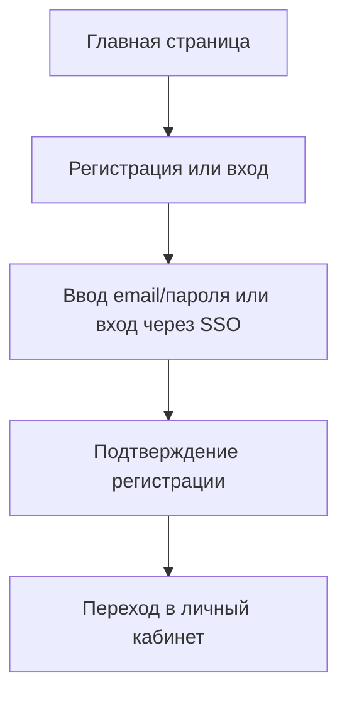
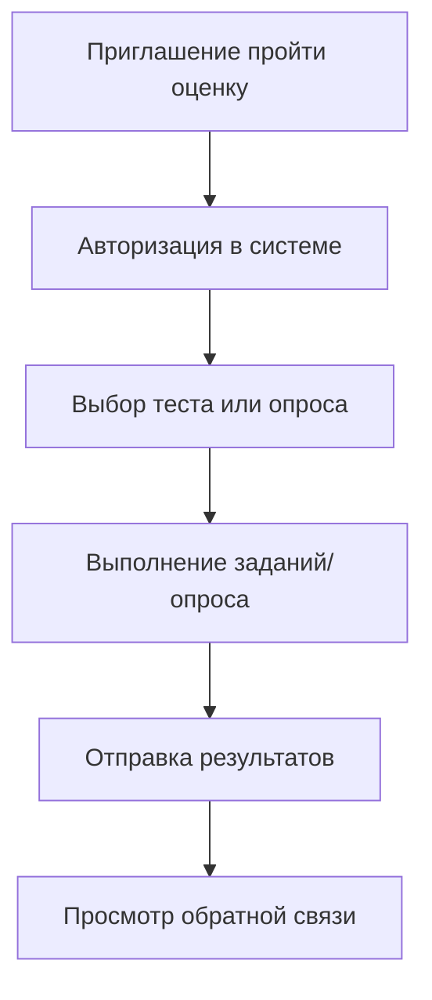
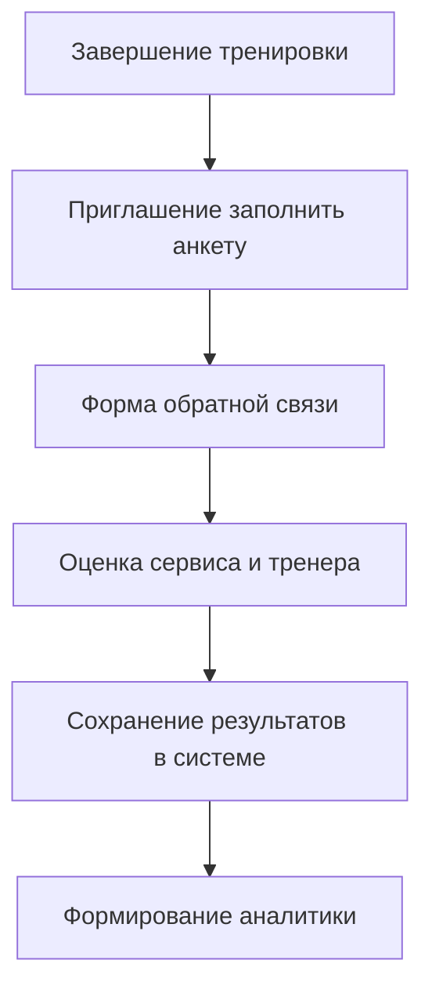
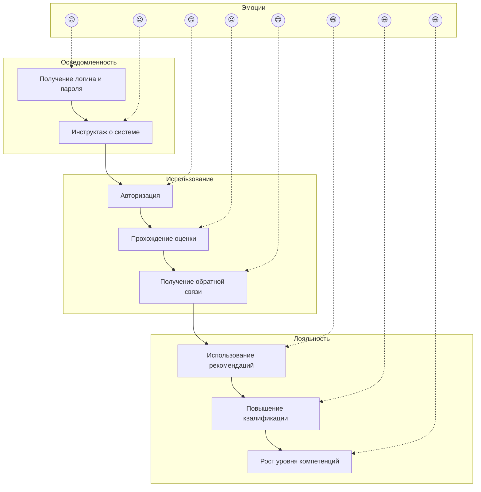
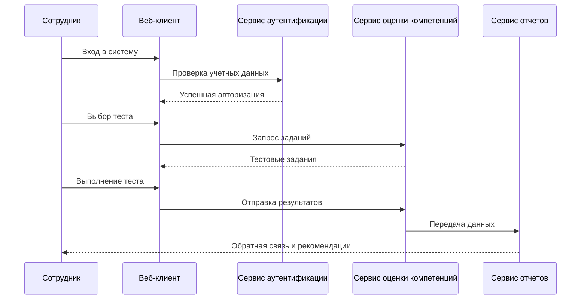
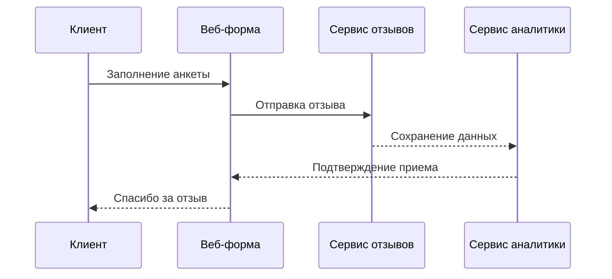

# Проектирование пользовательских сценариев и потоков

## Описание проекта

Веб-система предназначена для управления качеством обслуживания в спортивных клубах и оценки компетенций сотрудников (тренеров, администраторов и вспомогательного персонала).
Система позволяет автоматизировать процессы сбора обратной связи от клиентов, проведения внутренней оценки персонала и формирования аналитических отчетов для руководства.

## Пользовательские роли

| Роль    | Описание                                                                      |
|---------|-------------------------------------------------------------------------------|
| Client  | Посещает спортивный клуб, оставляет отзывы о качестве сервиса.                |
| Trainer | Проходит оценку компетенций, получает обратную связь.                         |
| Manager | Анализирует результаты тестов и опросов, формирует отчеты.                    |
| Admin   | Управляет системой: добавляет сотрудников, настраивает опросы и тесты.        |

## Ключевые пользовательские сценарии

| Сценарий                         | Действия пользователя                                                                                          |
|----------------------------------|----------------------------------------------------------------------------------------------------------------|
| Регистрация и вход               | Переход в систему → Вход через e-mail/SSO → Подтверждение e-mail → Личный кабинет.       |
| Добавление нового сотрудника     | Администратор → «Добавить сотрудника» → Ввод данных → Сотрудник появляется в системе.                              |
| Прохождение оценки компетенций   | Сотрудник → Получает приглашение → Проходит тест/опрос → Результаты сохраняются.           |
| Сбор отзывов от клиентов         | Клиент → Заполняет анкету после визита → Оценки фиксируются в системе. |
| Анализ результатов               | Менеджер качества → Открывает отчеты → Фильтрует по клубу/сотруднику → Просмотр.                                                   |
| Формирование отчета для руководства              | Система → Генерирует Excel/PDF → Экспорт → Отправка руководству.      |
| Обратная связь сотруднику | Менеджер качества → Формирует рекомендации → Сотрудник видит их в личном кабинете.          |
| Управление доступом   | Администратор → Настройки → Назначение ролей (Клиент/Сотрудник/Менеджер) → Сохранение.                                             |

## Customer Journey Map (визуальная схема)

### Регистрация и вход

### Прохождение оценки сотрудником

### Сбор отзывов от клиентов

### Customer Journey Map: Сотрудник

## UML Диаграммы взаимодействия
### Прохождение оценки сотрудником

### Оставление отзыва клиентом

